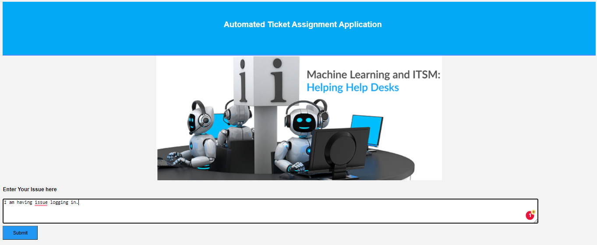
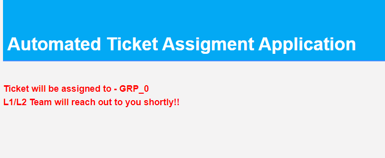

# Auto_Ticket_Assignment

Built a Flask application to classify tickets in an support service.

link to live application: https://automatic-ticket-app.herokuapp.com/

1)screenshot-1: Sample customer query:

2)screenshot-2: Response to customer query:

